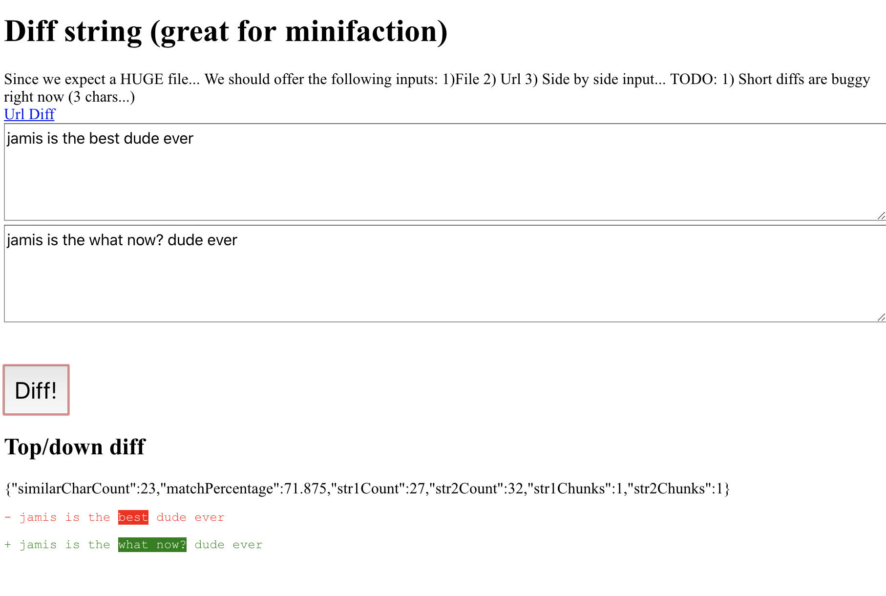
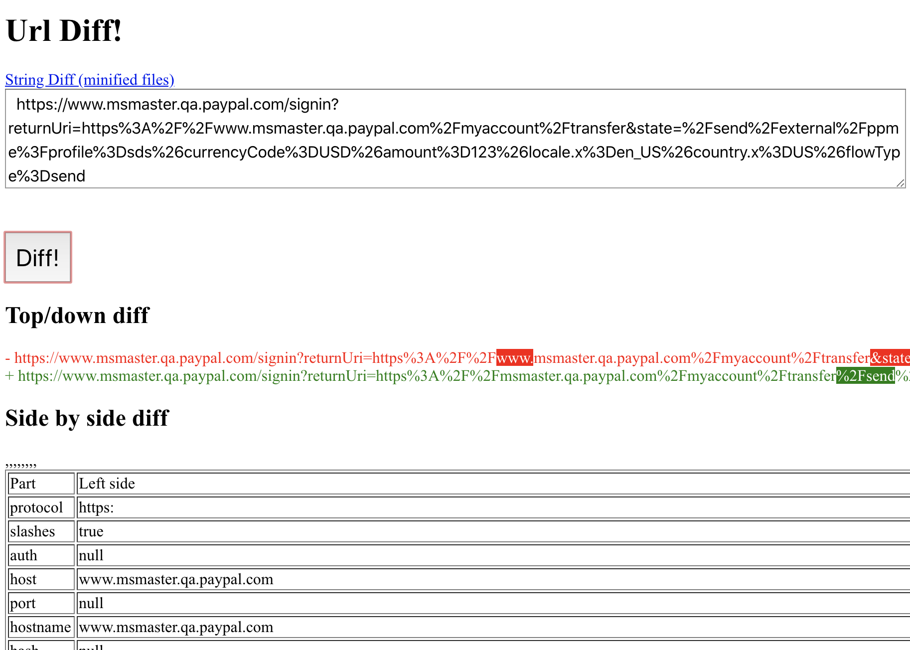

# differ

Alpha level experiment around a context-aware diffing tool

## Todo (if I ever have time)
- [ ] Add JSON mode
- [ ] Able to hide whitespace and prettier / eslint type changes
- [ ] Able to normalize prettier changes across both to detect the real changes
- [ ] Able to show only the parts that matter in a minified file


## Interesting projects to look at for techniques:
https://github.com/discord/endanger#diff
jest submodules (look for diff ones)

## Research:
- https://twitter.com/Vjeux/status/1264248339849068544
- https://twitter.com/floydophone/status/1256300099304476673
- https://twitter.com/collintmiller/status/1264267903001600000


## To Use


```bash
# Install dependencies
npm install
# Run the app
npm start
```


## Screenshots

---


[CC0 1.0 (Public Domain)](LICENSE.md)
